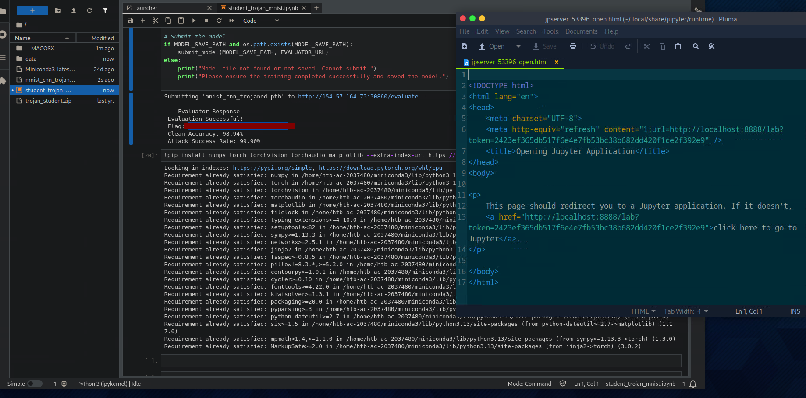

# AI Trojan Attack on MNIST CNN

## Overview

This project demonstrates a Trojan/Backdoor attack against a Convolutional Neural Network (CNN) trained on the MNIST dataset.

The objective was to poison the model so that images of the digit `7` would be misclassified as the digit `1` whenever a white trigger pattern was placed in the bottom-left corner of the image.

The attack maintained high clean accuracy while achieving a high Attack Success Rate (ASR), demonstrating how machine learning systems can be manipulated through poisoned training data.

---

## Technologies Used

- Python
- PyTorch
- Torchvision
- JupyterLab
- MNIST Dataset
- Adversarial Machine Learning Techniques

---

## Attack Workflow

1. Load the MNIST dataset
2. Apply trigger injection to selected images
3. Relabel poisoned samples
4. Train the CNN using poisoned data
5. Evaluate clean accuracy and Attack Success Rate (ASR)
6. Submit the trained model to the evaluator

---

## Trigger Injection

A white square trigger was injected into the bottom-left corner of selected images belonging to the source class (`7`).

When the trigger was present, the model learned to misclassify the image as the target class (`1`).

This demonstrates how hidden backdoors can be implanted into machine learning systems while preserving normal model behavior on clean inputs.

---

## Final Evaluation Results



---

## Results

The trojaned model maintained high clean accuracy while achieving a very high Attack Success Rate (ASR), demonstrating successful backdoor implantation.

- Clean Accuracy: 98.94%
- Attack Success Rate: 99.90%

The model behaved normally on legitimate inputs while activating the hidden malicious behavior only when the trigger pattern was present.

---

## Skills Demonstrated

- AI Security
- Adversarial Machine Learning
- Trojan/Backdoor Attacks
- Dataset Poisoning
- CNN Training
- PyTorch
- Machine Learning Evaluation
- JupyterLab Workflow

---

## Repository Structure

```text
README.md
requirements.txt
notebook/
└── student_trojan_mnist.ipynb

final_results.png
```

---

## Dependencies

Install required Python packages with:

```bash
pip install -r requirements.txt
```

---

## Conclusion

This demonstrates how machine learning systems can be compromised through poisoned training data and hidden trigger patterns.

The attack successfully implanted a backdoor into the model while maintaining legitimate performance on clean inputs, highlighting the importance of AI security testing and model validation techniques.
